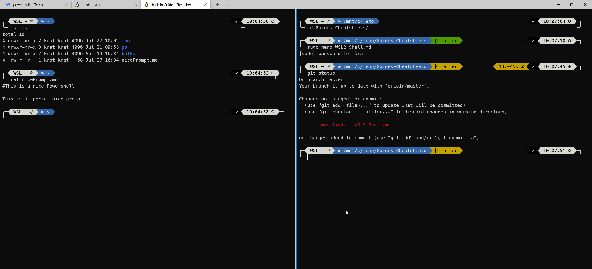

# How to pimp your Windows Terminal (Powershell + WSL2)

This is mainly a summary of [scott hanselmans guide](https://www.hanselman.com/blog/how-to-make-a-pretty-prompt-in-windows-terminal-with-powerline-nerd-fonts-cascadia-code-wsl-and-ohmyposh) plus some googeling to make *Oh my posh* run on my machine.



## On Windows:

* Install *Oh my posh* to get the fonts etc.
* see: https://ohmyposh.dev/docs/windows
```powershell
Install-Module posh-git -Scope CurrentUser
Install-Module oh-my-posh -Scope CurrentUser
Install-Module -Name PSReadLine -Scope CurrentUser -Force -SkipPublisherCheck
code $PROFILE
```
* add the following lines at the end of your profile
``` powershell
Import-Module posh-git
Import-Module oh-my-posh
Set-PoshPrompt -Theme powerlevel10k_rainbow
```
* preview available themes: ```Get-PoshThemes```

## In WSL

* Install oh-my-posh: 
``` bash
sudo wget https://github.com/JanDeDobbeleer/oh-my-posh/releases/latest/download/posh-linux-amd64 -O /usr/local/bin/oh-my-posh
sudo chmod +x /usr/local/bin/oh-my-posh
```
* Download Posh-Themes:
``` bash
mkdir ~/.poshthemes
wget https://github.com/JanDeDobbeleer/oh-my-posh/releases/latest/download/themes.zip -O ~/.poshthemes/themes.zip
unzip ~/.poshthemes/themes.zip -d ~/.poshthemes
chmod u+rw ~/.poshthemes/*.json
rm ~/.poshthemes/themes.zip
```
* Try it out with: ```eval "$(oh-my-posh --init --shell bash --config ~/.poshthemes/powerlevel10k_rainbow.omp.json)"```
* if it's working copy this to the end of your ```~/.bashrc``` file.

## Download & Install Fonts on Windows

* This solves the issue with squares instead of symbols in the prompts
* https://www.nerdfonts.com/font-downloads f.e.: Meslo NerdFont

## Set required Font in all Shells

https://stackoverflow.com/questions/66042480/not-getting-cascadia-code-pl-in-powershell

### In Terminal - settings.json
``` 
 "profiles":
    {
        "defaults":
        {
            // Put settings here that you want to apply to all profiles.
            "fontFace": "MesloLGM NF"  //"Cascadia Code PL"
        },
   ....
```
